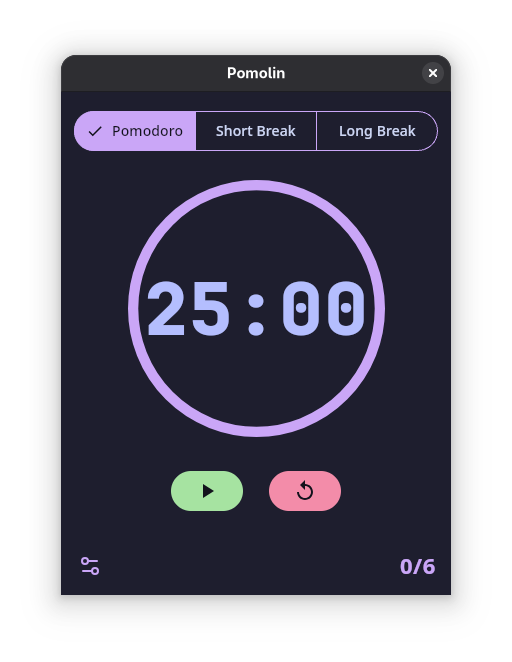

<p align="center">
  
</p>

<h1 align="center">Pomolin</h1>


<div align="center">


</div>

<p align="center">
  
  
</p>

#### A simple, beautiful, and minimalist Pomodoro timer for your desktop. Designed to help you stay focused and productive, it provides an elegant and straightforward way to manage your work and break intervals.

## Features

* **Smooth Animations:** The timer digits animate smoothly, offering a dynamic and visually
  pleasing experience.
* **Routine Management:** Switch between **Pomodoro (25 min)**, **Short Break (5
  min)**, and **Long Break (20 min)** routines.
* **Custom Work/Break Durations:** Change the working or break durations in settings menu.
* **Cross-Platform:** Native installers are provided for Windows, macOS, and Linux on
  both `x64` and `arm64` architectures.
* **Pastel Color Palette:** UI uses Catppuccin Mocha Color Palette as the default theme.

## Download & Run

You can download the latest version of Pomolin from the
**[Latest Release](https://github.com/RedddFoxxyy/pomolin/releases/latest)** page.

### Windows

1. Download the `.msi` or `.exe` file.
2. Run the installer and follow the on-screen instructions.

   > **NOTE**:
   >
   > Browsers may say that the files can be harmful, you can bypass that message and continue download. Windows
   > Defender will also try to stop you from running the installer, just click on `more options` and then click
   `run anyway`.

### macOS

1. Download the `.dmg` or `.pkg` file from **[Latest Release](https://github.com/RedddFoxxyy/pomolin/releases/latest)**.
2. Open the `.dmg` file and drag the `Pomolin.app` to your `Applications` folder.

   > **NOTE**:
   >
   > For macOS, it will not allow you to run the .pkg or the app installed using .dmg, to do so
   > you will have to go to `privacy and security` in system settings,
   > and then allow the execution of the app.

### Linux

* Get the app from FlatHub:

  <a href='https://flathub.org/apps/io.github.redddfoxxyy.pomolin'>
  
  </a>

* Get the `.deb` files for Debian and Ubuntu from
  **[Latest Release](https://github.com/RedddFoxxyy/pomolin/releases/latest)**.
* Get `AppImage` files for respective hardware from
  **[Latest Release](https://github.com/RedddFoxxyy/pomolin/releases/latest)**.
* Get `Flatpak` files for respective hardware from
  **[Latest Release](https://github.com/RedddFoxxyy/pomolin/releases/latest)**.

  > **NOTE**:
  > - Install `AppImage` using `AppImageLauncher`/`Gear Lever` or equivalent. You can run the AppImage just by
	  double-clicking on it too, no need to install it.
  > - Flatpaks and AppImages are the preferred ways to run the app on Linux-based distributions.

### JVM

1. Download the `.jar` file for your OS and CPU.
2. Run it using JRE/JDK 24:

   ```bash
   java -jar pomolin-macos-arm64-1.1.7-release.jar 
   ```

   > **NOTE**:
   > Make sure that you use java24 to run the jars. (Java21 on Windows Arm64).
   > Preferably use Temurin or ZULU JRE/JDK.

## Building from Source

To build Pomolin from the source code, you'll need to have **JDK 21** or later installed.

1. **Clone the repository:**
   ```bash
   git clone [https://github.com/RedddFoxxyy/pomolin.git](https://github.com/RedddFoxxyy/pomolin.git)
   cd pomolin
   ```

2. **Build the application using Gradle:**

	* On **Linux**:
	    ```bash
		./gradlew packageReleaseDeb
		```
	* On **macOS**:
	    ```bash
		./gradlew packageReleaseDmg
		```
	* On **Windows**:
	    ```bash
		.\gradlew.bat packageReleaseMsi
		```

3. The compiled application will be available in the `composeApp/build/compose/binaries/` directory.

## License

This project is licensed under the **GNU Affero General Public License v3.0**. See
the [LICENSE](LICENSE) file for details.

Contributions made by all contributors are licensed strictly under **GNU AGPL v3.0 only**.

```
    Copyright (C) 2025  RedddFoxxyy(Suyog Tandel)

    This program is free software: you can redistribute it and/or modify
    it under the terms of the GNU Affero General Public License as
    published by the Free Software Foundation, either version 3 of the
    License, or (at your option) any later version.

    This program is distributed in the hope that it will be useful,
    but WITHOUT ANY WARRANTY; without even the implied warranty of
    MERCHANTABILITY or FITNESS FOR A PARTICULAR PURPOSE.  See the
    GNU Affero General Public License for more details.

    You should have received a copy of the GNU Affero General Public License
    along with this program.  If not, see <https://www.gnu.org/licenses/>.
```

### Licensed Assets (CC BY-NC-ND 4.0)

The following directories contain artwork (app icons, logos, images, etc.) that are licensed under the [Creative Commons
Attribution-NonCommercial-NoDerivatives 4.0 International License (CC BY-NC-ND 4.0)](https://creativecommons.org/licenses/by-nc-nd/4.0/).
For full details, refer
to the `LICENSE.md` file located in each such directory:

- `gitAssets/`
- `composeApp/src/desktopMain/composeResources/drawable/`
- `packaging/flatpak/`

## Maintainers

[@RedddFoxxyy](https://github.com/RedddFoxxyy)
